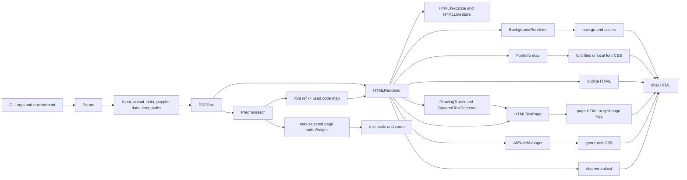

# Data Flow

[Documentation Home](../README.md)

The converter moves data from CLI options and PDF objects into generated HTML,
CSS, fonts, images, and page fragments. The code does not define a separate
large intermediate representation for the whole document. Instead, it keeps a
small set of per-document maps, per-page text lines, CSS state managers, and
temporary streams.

## Inputs

CLI options are registered in `parse_options` in `pdf2htmlEX/src/pdf2htmlEX.cc`.
They write directly into the global `Param param` object. Positional arguments
become `param.input_filename` and optional `param.output_filename`.

Environment values visible in code and scripts include:

- `TMPDIR`: default temp root on non-MinGW builds
- `APPDIR`: AppImage path adjustment for `data_dir`
- `PDF2HTMLEX_VERSION`, `POPPLER_VERSION`, `FONTFORGE_VERSION`: build-script
  version inputs
- `PDF2HTMLEX_PREFIX`: install prefix used by build/install scripts
- `MAKE_PARALLEL`, `UNATTENDED`, `DEBIAN_FRONTEND`: build-script behavior
- `P2H_TEST_GEN`: test reference generation mode
- `SAUCE_USERNAME`, `SAUCE_ACCESS_KEY`: remote browser test credentials

## PDF Loading

`main` constructs optional Poppler owner and user passwords, then creates a
`PDFDoc` using `PDFDocFactory`. Page bounds and page count are read from that
document. Copy permission is checked before conversion unless `--no-drm 1` is
set.

`GlobalParams` receives the configured Poppler data directory. This is important
for CMaps and CJK text handling.

## Preprocessor Data

`Preprocessor` keeps:

- `code_maps`: `font_id -> char*`, where `font_id` is the hash of a Poppler font
  object reference
- `max_width` and `max_height`: maximum selected page dimensions

The font code maps are later used by `HTMLRenderer::embed_font` to subset and
reencode only used glyph/code slots.

## Per-Page Text Data

`HTMLRenderer` converts Poppler text state into:

- `FontInfo`: font id, Unicode strategy, em size, space width, ascent/descent,
  Type 3 flag, and Type 3 scaling factor
- `HTMLTextState`: font, size, fill/stroke color, letter/word spacing,
  vertical alignment
- `HTMLLineState`: line origin, transform matrix, and covered-text lookup
- `HTMLTextLine`: Unicode text, decomposed Unicode runs, offsets, and state
  changes
- `HTMLTextPage`: current page lines and clip ranges

The page text buffer is emitted at `endPage`, not immediately during
`drawString`, because coverage and clipping are page-local decisions.

## CSS State Data

`AllStateManager` owns managers for transform matrices, vertical alignment,
stroke/fill colors, letter/word spacing, whitespace offsets, font size, bottom,
height, width, left, and background image size. Each manager interns repeated
values and returns a compact numeric class id.

Examples of generated class prefixes come from `pdf2htmlEX/src/util/css_const.h`
and include:

- `t`: text line
- `m`: transform matrix
- `ff`: font family
- `fs`: font size
- `fc`: fill color
- `sc`: stroke color
- `ls`: letter spacing
- `ws`: word spacing
- `x`, `y`, `w`, `h`: position and dimensions
- `pf`, `pc`, `pi`: page frame, content box, and page data
- `bi`, `bf`: bitmap/background image classes

## Font Data

Fonts flow through `HTMLRenderer::install_font`:

1. Map Poppler font references to `FontInfo`.
2. Determine whether the font is embedded, external, Type 3, writing-mode, or
   unsupported.
3. Dump embedded font streams when present.
4. For Type 3 with `--process-type3 1`, render glyphs to SVG with Cairo and
   import them into a generated FontForge font.
5. Use `util/ffw.c` to reencode, set widths, fix metrics, hint, override fstype
   if requested, and save the requested font format.
6. Emit `@font-face` rules or local font-family CSS.

## Background And Image Data

Individual `drawImage` callbacks are used for coverage tracing, but page image
assets are produced by rendering whole pages through a background renderer.

Splash output writes `bg<page>.<format>` for PNG/JPEG. Cairo output writes
`bg<page>.svg`; when `--svg-embed-bitmap 0`, suitable RGB/gray JPEG image
streams can be dumped as `o<object-id>.jpg` and referenced from SVG output.

## Output Data

Final outputs depend on embedding and split options:

- main HTML: always generated
- CSS: embedded in HTML or written as `css-filename`
- fonts: embedded in CSS or written as `f<id>.<font-format>`
- images: embedded as data URIs or written as `bg<page>.*` and optional
  `o<object-id>.jpg`
- outline: embedded or written as `outline-filename`
- split page files: written from `page-filename` when `--split-pages 1`
- static resources: copied or embedded from `data-dir` through `share/manifest`

Temporary files are registered with `TmpFiles` and removed when
`--clean-tmp 1`.
