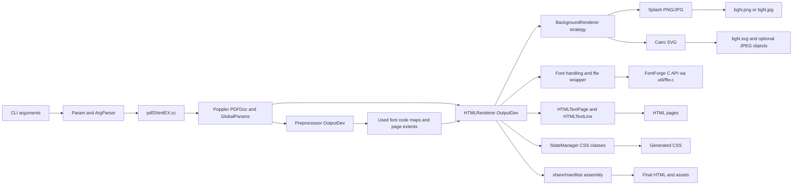

# Architecture Overview

[Documentation Home](../README.md)

The current repository contains the converter source in `pdf2htmlEX/`, build
automation in `buildScripts/`, test tooling in `pdf2htmlEX/test/`, and checked
out source/build trees for Poppler, FontForge, and poppler-data. The converter
binary is built from C++ and C sources under `pdf2htmlEX/src`.

At runtime, `pdf2htmlEX` opens a PDF with Poppler, scans it once to collect text
and page metrics, then renders it through Poppler `OutputDev` callbacks into
HTML, CSS, font files, page background images, outlines, links, and optional
form elements.

The project wiki describes the user-visible goals as accurate fixed-layout
HTML, selectable/searchable native text where possible, flexible embedded or
separate assets, links, outlines, experimental printing support, clipping, SVG
backgrounds, and experimental Type 3 font handling. The implementation below is
the current code path behind those goals.

## Main Components

For the main engineering choices behind this architecture, see
[Design Solutions](design-solutions.md). For recurring implementation shapes,
see [Design Patterns](design-patterns.md).

`pdf2htmlEX/src/pdf2htmlEX.cc`
: Program entry point. It initializes default paths, registers CLI options,
checks input/output filenames, creates a temporary directory, initializes
Poppler `GlobalParams`, opens the `PDFDoc`, checks copy permission, and calls
`HTMLRenderer::process`.

`pdf2htmlEX/src/Param.h`
: Shared configuration object populated by CLI parsing and read throughout the
conversion pipeline.

`pdf2htmlEX/src/Preprocessor.*`
: First Poppler `OutputDev` pass. It records which character codes are used by
each PDF font and tracks maximum selected page width and height for fit/zoom
calculation.

`pdf2htmlEX/src/HTMLRenderer/`
: Main conversion device. `HTMLRenderer` receives Poppler rendering callbacks,
tracks graphics/text state, emits HTML text, CSS classes, link overlays,
outlines, forms, and delegates background rendering.

`pdf2htmlEX/src/BackgroundRenderer/`
: Background rendering abstraction. `SplashBackgroundRenderer` writes bitmap
page backgrounds for PNG/JPEG; `CairoBackgroundRenderer` writes SVG page
backgrounds when SVG support is enabled.

`pdf2htmlEX/src/HTMLTextPage.*` and `pdf2htmlEX/src/HTMLTextLine.*`
: Per-page text storage and HTML text emission. These classes group text into
absolute positioned lines, manage state spans, whitespace offsets, clipping,
and optional text optimization.

`pdf2htmlEX/src/StateManager.h`
: CSS class interning for reusable numeric, color, and transform states.
Generated classes keep HTML compact and make layout values reusable.

`pdf2htmlEX/src/util/ffw.c` and `pdf2htmlEX/src/util/ffw.h`
: C wrapper around FontForge internals. It is used by the C++ font pipeline to
load, reencode, adjust metrics, hint, and save web fonts.

`pdf2htmlEX/share/`
: Runtime data directory templates and static assets. `share/manifest`
controls final HTML assembly. `base.css.in`, `fancy.css.in`, and
`pdf2htmlEX.js.in` are configured by CMake into concrete files.

## Repository Shape

The build scripts expect Poppler and FontForge source directories at repository
root (`poppler/`, `fontforge/`) and link static libraries from their build
trees. That is why this repository is not a simple single-CMake-project layout.
The local checkout also contains `pdf2htmlEX/build/`, `poppler/build/`, and
`fontforge/build/` directories from a previous build.

## Verified Local State

The existing binary at `pdf2htmlEX/build/pdf2htmlEX` is executable and reports
Poppler `24.06.1`, FontForge `20230101`, and Cairo `1.18.4`. A fresh rebuild
with the installed CMake `4.3.0` failed during configure policy checks before
source compilation.
