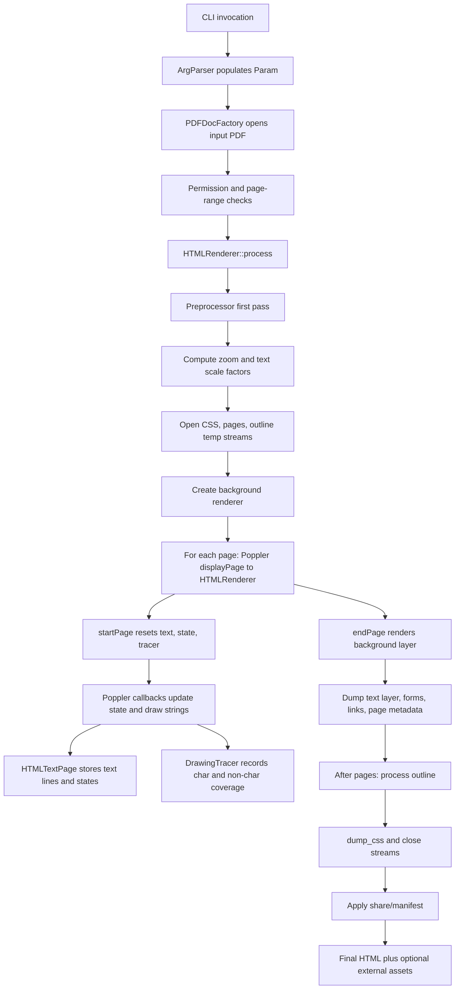
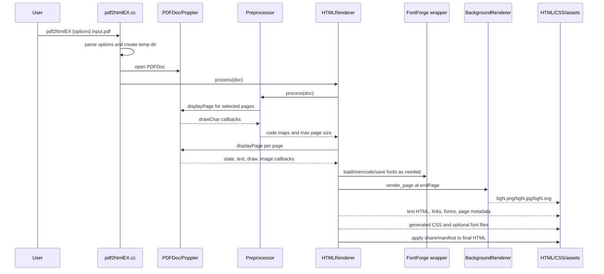

# Rendering Pipeline

[Documentation Home](../README.md)

The converter uses a two-pass Poppler rendering pipeline.

The first pass is a preprocessing scan. It uses `Preprocessor`, an `OutputDev`
that requests character callbacks but not non-text drawing. This pass records
which character codes are used for each PDF font and the maximum selected page
dimensions.

The second pass uses `HTMLRenderer`, another `OutputDev`, to convert selected
pages into HTML text, CSS classes, web fonts, background images, links, forms,
and outline data.

## Stage 1: CLI And Setup

`main` in `pdf2htmlEX/src/pdf2htmlEX.cc` sets default `tmp_dir`, `data_dir`,
and `poppler_data_dir`, then calls `parse_options`.

Important setup behavior:

- `TMPDIR`, `P_tmpdir`, `_PATH_TMP`, or `/tmp` determine the default temp root
  on non-MinGW builds.
- `APPDIR` prepends the AppImage runtime directory to `data_dir`.
- `--data-dir` and `--poppler-data-dir` can override runtime data locations.
- `prepare_directories` creates a unique temp directory named
  `pdf2htmlEX-XXXXXX` under `param.tmp_dir`.
- `GlobalParams` is initialized with `param.poppler_data_dir` when set.
- `PDFDocFactory().createPDFDoc` opens the PDF using optional owner/user
  passwords.
- If Poppler reports copy protection and `--no-drm` is not set, conversion
  fails before rendering.

## Stage 2: Preprocessing

`HTMLRenderer::pre_process` calls `preprocessor.process(doc)`.

`Preprocessor::process` iterates from `param.first_page` to `param.last_page`
and calls Poppler `displayPage` at `DEFAULT_DPI`. Its `drawChar` method:

- obtains the current `GfxFont`
- hashes the font object reference with `hash_ref`
- creates a code map sized to `0x100` for 8-bit fonts or `0x10000` for CID
  fonts
- marks each observed `CharCode` as used

`Preprocessor::startPage` records maximum selected page width and height. The
main renderer uses these values to resolve `--zoom`, `--fit-width`, and
`--fit-height`.

## Stage 3: Output Stream Preparation

`HTMLRenderer::pre_process` determines:

- `text_scale_factor1`: max of zoom and `--font-size-multiplier`
- `text_scale_factor2`: zoom divided by `text_scale_factor1`
- CSS output path: temp `__css` if CSS is embedded, otherwise
  `dest-dir/css-filename`
- outline output path: temp `__outline` if embedded, otherwise
  `dest-dir/outline-filename`
- pages output path: temp `__pages` for the main page stream

If `--split-pages 1` is enabled, each page is written to a separate page file
while `__pages` receives empty frames with `data-page-url`.

## Stage 4: Per-Page Conversion

For each selected page, `HTMLRenderer::process`:

1. Sets `param.actual_dpi` to `param.desired_dpi`.
2. Computes `param.max_dpi` from page dimensions and `MAX_DIMEN` (`9000`).
3. Clamps `actual_dpi` if needed.
4. Stops if `--tmp-file-size-limit` is exceeded after a page.
5. Calls Poppler `displayPage` with `text_zoom_factor() * DEFAULT_DPI`.

Poppler then invokes `HTMLRenderer` callbacks:

- state updates in `state.cc`
- text drawing in `text.cc`
- font installation in `font.cc`
- path/image coverage tracing in `draw.cc` and `image.cc`
- clipping callbacks in `state.cc`

`startPage` resets `HTMLTextPage`, `CoveredTextDetector`, `DrawingTracer`, and
HTML/PDF state. `endPage` writes the page frame and content box, then emits the
background layer, text layer, optional forms, links, and page metadata.

## Stage 5: Text Layer

`drawString` reads Poppler glyphs with `font->getNextChar`. For each glyph it:

- checks whether the current text state requires raster fallback
- traces a glyph box through `DrawingTracer`
- maps glyph code to Unicode through ToUnicode data or font-derived mappings
- optionally decomposes ligatures
- appends Unicode text and offsets to the current `HTMLTextLine`

Text is stored first and dumped at `endPage`. This allows the line emitter to
hide covered characters visually, optimize spacing, and write clipping wrappers
after all glyph coverage information is available for the page.

## Stage 6: Background Layer

If `--process-nontext 1`, `HTMLRenderer` creates a `BackgroundRenderer`:

- `SplashBackgroundRenderer` for `--bg-format png` or `jpg`
- `CairoBackgroundRenderer` for `--bg-format svg` when SVG support is enabled

At `endPage`, the selected background renderer renders the page again through
Poppler and writes a full-page or page-sized background asset. Covered text,
fallback text, Type 3 text when not processed as web fonts, writing-mode text,
and text-as-path are drawn into this layer.

For SVG output, `CairoBackgroundRenderer` can fall back to Splash if
`--svg-node-count-limit` is set and the generated SVG exceeds the approximate
node limit.

## Stage 7: Fonts And CSS

`install_font` maps a PDF font reference to a `FontInfo`. Embedded fonts are
dumped from PDF font streams, then passed through `embed_font`. External fonts
are located through Poppler/fontconfig and either embedded or represented as a
local CSS font-family depending on `--embed-external-font`.

`StateManager` instances collect CSS classes as text and layout states are
encountered. At `post_process`, `dump_css` writes classes for transforms,
spacing, colors, dimensions, font sizes, print styles, and background sizes.

## Stage 8: Final HTML Assembly

`HTMLRenderer::post_process` closes temporary streams, opens
`dest-dir/output-filename`, and applies `share/manifest`.

Manifest commands are:

- `"""`: copy literal HTML until the next triple quote line
- `@file`: embed or link a static data-dir file according to the related
  `--embed-*` option
- `$css`: insert or link generated PDF-specific CSS
- `$outline`: insert generated outline HTML when enabled and embedded
- `$pages`: insert generated page frames/content

The manifest creates the final document shell, optional sidebar, `page-container`,
static CSS/JS, pages, and loading indicator.

## Conversion Sequence

