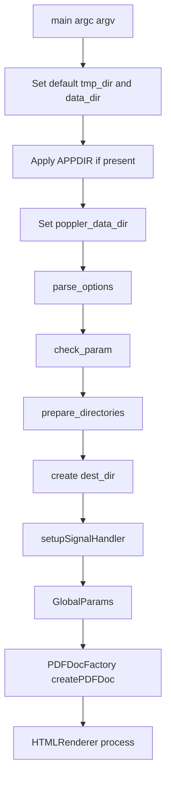

# CLI And Options

[Documentation Home](../README.md)

The CLI entry point is `main` in `pdf2htmlEX/src/pdf2htmlEX.cc`.

The project wiki has a command-line page, but it identifies itself as the
manual for version `0.12`. This page documents the current checkout from
`pdf2htmlEX/src/pdf2htmlEX.cc`, `pdf2htmlEX/pdf2htmlEX.1.in`, and
`pdf2htmlEX/build/pdf2htmlEX --help`.

Options are registered in `parse_options` through the global `ArgParser
argparser`. Each option writes directly into the global `Param param` declared
in the same file and typed in `pdf2htmlEX/src/Param.h`.

## Startup Flow

## Positional Arguments

`parse_options` registers two positional arguments:

- input filename, required
- output filename, optional

If output filename is omitted, `check_param` derives it from the input filename:

- `file.pdf` becomes `file.html`
- another input suffix becomes `<filename>.html`

## Path Defaults

On non-MinGW builds:

- temp root comes from `TMPDIR`, then `P_tmpdir`, then `_PATH_TMP`, then `/tmp`
- data directory comes from compiled `PDF2HTMLEX_DATA_PATH`
- `APPDIR`, when present, is prepended to `data_dir`
- `poppler_data_dir` defaults to `data_dir + "/poppler"`

`prepare_directories` creates a unique temp directory under the temp root using
`mkdtemp` and a `pdf2htmlEX-XXXXXX` template.

## Option Categories

### Pages

| Option | Param field | Default in source |
| --- | --- | --- |
| `-f`, `--first-page` | `first_page` | `1` |
| `-l`, `--last-page` | `last_page` | `numeric_limits<int>::max()` |

`main` clamps both values to the actual document page count after opening the
PDF.

### Dimensions

| Option | Param field | Default |
| --- | --- | --- |
| `--zoom` | `zoom` | `0` |
| `--fit-width` | `fit_width` | `0` |
| `--fit-height` | `fit_height` | `0` |
| `--use-cropbox` | `use_cropbox` | `1` |
| `--dpi` | `desired_dpi` | `144.0` |

The manpage template still documents older `--hdpi` and `--vdpi` names, but the
current source registers a single `--dpi` option.

### Output Files And Embedding

| Option | Param field | Default |
| --- | --- | --- |
| `--embed` | multiple fields via `embed_parser` | not a field |
| `--embed-css` | `embed_css` | `1` |
| `--embed-font` | `embed_font` | `1` |
| `--embed-image` | `embed_image` | `1` |
| `--embed-javascript` | `embed_javascript` | `1` |
| `--embed-outline` | `embed_outline` | `1` |
| `--split-pages` | `split_pages` | `0` |
| `--dest-dir` | `dest_dir` | `.` |
| `--css-filename` | `css_filename` | derived if empty |
| `--page-filename` | `page_filename` | derived if empty |
| `--outline-filename` | `outline_filename` | derived if empty |
| `--process-nontext` | `process_nontext` | `1` |
| `--process-outline` | `process_outline` | `1` |
| `--process-annotation` | `process_annotation` | `0` |
| `--process-form` | `process_form` | `0` |
| `--printing` | `printing` | `1` |
| `--fallback` | `fallback` | `0` |
| `--tmp-file-size-limit` | `tmp_file_size_limit` | `-1` |

`--embed` accepts characters:

- `c`/`C`: CSS off/on
- `f`/`F`: font off/on
- `i`/`I`: image off/on
- `j`/`J`: JavaScript off/on
- `o`/`O`: outline off/on

### Fonts

| Option | Param field | Default |
| --- | --- | --- |
| `--embed-external-font` | `embed_external_font` | `1` |
| `--font-format` | `font_format` | `woff` |
| `--decompose-ligature` | `decompose_ligature` | `0` |
| `--turn-off-ligatures` | `turn_off_ligatures` | `0` |
| `--auto-hint` | `auto_hint` | `0` |
| `--external-hint-tool` | `external_hint_tool` | empty |
| `--stretch-narrow-glyph` | `stretch_narrow_glyph` | `0` |
| `--squeeze-wide-glyph` | `squeeze_wide_glyph` | `1` |
| `--override-fstype` | `override_fstype` | `0` |
| `--process-type3` | `process_type3` | `0` |

If `--font-format ttf` is used without an external hint tool, `check_param`
prints a warning.

### Text

| Option | Param field | Default |
| --- | --- | --- |
| `--heps` | `h_eps` | `1.0` |
| `--veps` | `v_eps` | `1.0` |
| `--space-threshold` | `space_threshold` | `1.0/8` |
| `--font-size-multiplier` | `font_size_multiplier` | `4.0` |
| `--space-as-offset` | `space_as_offset` | `0` |
| `--tounicode` | `tounicode` | `0` |
| `--optimize-text` | `optimize_text` | `0` |
| `--correct-text-visibility` | `correct_text_visibility` | `1` |
| `--covered-text-dpi` | `text_dpi` | `300` |

`--correct-text-visibility` accepts:

- `0`: no text visibility checks
- `1`: handle fully occluded text
- `2`: handle partially occluded text and potentially raise raster DPI

### Background Image

| Option | Param field | Default |
| --- | --- | --- |
| `--bg-format` | `bg_format` | `png` |
| `--svg-node-count-limit` | `svg_node_count_limit` | `-1` |
| `--svg-embed-bitmap` | `svg_embed_bitmap` | `1` |

`check_param` accepts only image formats compiled into the binary. The existing
local binary supports `png`, `jpg`, and `svg`.

### PDF Protection

| Option | Param field | Default |
| --- | --- | --- |
| `-o`, `--owner-password` | `owner_password` | empty |
| `-u`, `--user-password` | `user_password` | empty |
| `--no-drm` | `no_drm` | `0` |

If Poppler reports that copying text is not allowed and `--no-drm 0`, conversion
fails before rendering.

### Miscellaneous

| Option | Param field | Default |
| --- | --- | --- |
| `--clean-tmp` | `clean_tmp` | `1` |
| `--tmp-dir` | `tmp_dir` | runtime default |
| `--data-dir` | `data_dir` | compiled default |
| `--poppler-data-dir` | `poppler_data_dir` | `data_dir/poppler` |
| `--debug` | `debug` | `0` |
| `--proof` | `proof` | `0` |
| `--quiet` | `quiet` | `0` |
| `-v`, `--version` | callback | exits |
| `-h`, `--help` | callback | exits |

## Filename Derivation

`check_param` derives:

- `output_filename`
- `page_filename`
- `css_filename`
- `outline_filename`

`sanitize_filename` in `util/path.cc` allows only the first valid `%d`-style
page-number placeholder for split-page output. Other percent sequences are
escaped to literal `%%` if a valid placeholder is found; if none is found,
`check_param` inserts `%d` before the extension or at the end.

## Wiki Recipe Options

The wiki quick-start examples map to these current options:

| Recipe | Current options |
| --- | --- |
| simple zoomed conversion | `--zoom 1.3 input.pdf` |
| page range with fixed width | `-f 3 -l 5 --fit-width 1024` |
| JPEG backgrounds | `--bg-format jpg` |
| publisher output with separate assets | `--embed cfijo --dest-dir out` |
| split page fragments | `--split-pages 1 --page-filename name-%d.page` |
| image-heavy compatibility output | `--fallback 1` |
| better font hinting when available | `--external-hint-tool=ttfautohint` |
| CJK/poppler data override | `--poppler-data-dir /path/to/poppler-data` |
