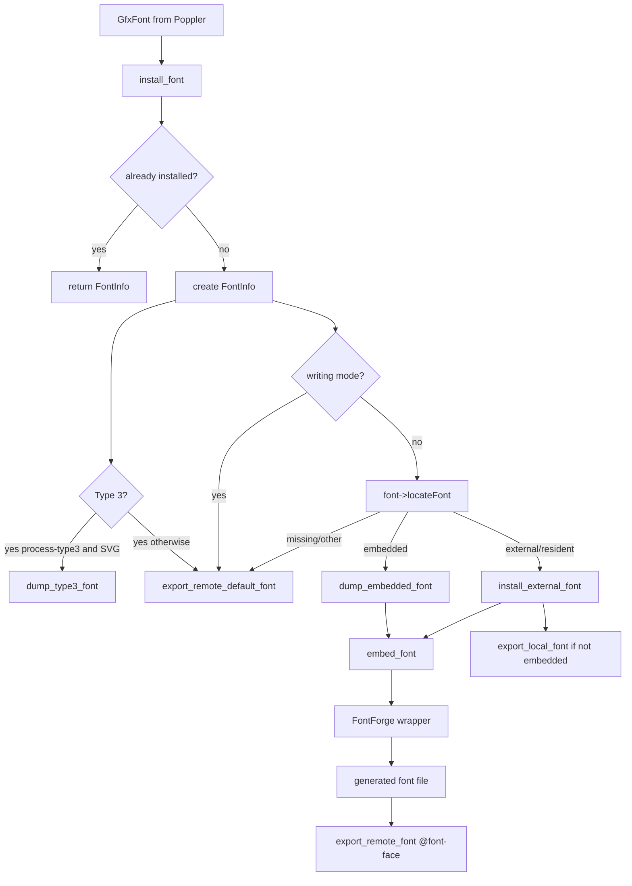

# Font Handling

[Documentation Home](../README.md)

Font handling is centered in `pdf2htmlEX/src/HTMLRenderer/font.cc` and the
FontForge wrapper `pdf2htmlEX/src/util/ffw.c`.

The converter tries to keep text selectable by producing web fonts that match
PDF glyph metrics and encodings. When it cannot, text may fall back to hidden
font CSS and visual rendering in the page background.

## Font Installation Flow



## FontInfo

`FontInfo` in `HTMLState.h` stores:

- numeric font id
- whether to use ToUnicode for text mapping
- em size
- space width
- ascent and descent
- Type 3 flag
- Type 3 font-size scale

The font id used in CSS is assigned from `font_info_map.size()`, while the map
key is the hash of the Poppler font object reference.

## Embedded Fonts

`dump_embedded_font` reads the PDF font object and its `FontDescriptor`.
It handles:

- `FontFile3` with subtype `Type1C` -> `.cff`
- `FontFile3` with subtype `CIDFontType0C` -> `.cid`
- `FontFile3` with subtype `OpenType` -> `.otf`
- `FontFile2` -> `.ttf`
- `FontFile` -> `.pfa`

The raw font stream is written to the temp directory as:

```text
f<font-id>.<suffix>
```

That file is registered with `TmpFiles` for cleanup.

## External Fonts

For fonts not embedded in the PDF, `install_external_font` asks Poppler to
locate a local font. If `--embed-external-font 1` and Poppler finds a local
path, the local font is passed through the same `embed_font` pipeline as an
embedded font.

If embedding is disabled or location fails, the converter emits a local CSS
font-family rule using the original font name and a generic family derived from
Poppler font flags:

- fixed-width -> `monospace`
- serif -> `serif`
- otherwise -> `sans-serif`

There is a hard-coded workaround map for several GB-encoded Chinese font names
in `util/const.cc`.

The wiki explains the user-facing reason for the default. PDF viewers assume a
small standard set of fonts and may also substitute locally installed fonts, but
the Web has no identical standard PDF font set. Embedding local matches favors
visual fidelity for users who do not know which fonts are safe to omit. The
tradeoff is output size.

Use Poppler's `pdffonts` to inspect an input PDF before changing font options:

```sh
pdffonts input.pdf
```

Important columns include whether a font is embedded (`emb`), subset (`sub`),
and has Unicode information (`uni`).

The wiki also notes that apparently duplicated PDF fonts may still be emitted as
separate web fonts. This source treats font objects separately after hashing the
Poppler font reference, so optimizing the input PDF may be the better way to
reduce duplicate font output.

## Type 3 Fonts

Type 3 fonts are special because glyphs are PDF drawing programs, not normal
font outlines.

If `--process-type3 0`, Type 3 text is rendered into the background image and
the HTML text layer uses a hidden default font class.

If `--process-type3 1` and SVG support is compiled in, `dump_type3_font`:

1. creates a Cairo font engine
2. computes transformed font bounding box and scale
3. renders each used glyph to a temporary SVG
4. imports SVG glyphs into a new FontForge font with `ffw_import_svg_glyph`
5. saves a temporary TTF
6. passes that font through the normal embedding pipeline

The code labels Type 3 processing as experimental in the manpage.

## Reencoding And Unicode Mapping

`embed_font` performs several steps:

1. Load font with `ffw_load_font`.
2. Remove kerning and alternate Unicode mappings with `ffw_prepare_font`.
3. Decide 8-bit font versus CID font.
4. For TrueType-like fonts, reencode by glyph order and optionally use Poppler
   code-to-GID maps.
5. For 8-bit non-TrueType fonts, reencode by glyph names.
6. For CID non-TrueType fonts, flatten CID fonts.
7. Traverse used codes from `Preprocessor`.
8. Map codes to Unicode using ToUnicode or font-derived logic.
9. Detect ToUnicode collisions. In auto mode (`--tounicode 0`), the converter
   retries with ToUnicode disabled.
10. Build width lists and force reencoding.
11. Add an empty space glyph when needed for selection/copy behavior.

The final reencoding uses FontForge's `UnicodeFull` encoding so Unicode values
above `0xFFFF` are preserved.

## Widths And Metrics

The converter computes PDF glyph widths, normalizes by `font_size_scale`, then
uses `ffw_set_widths`.

Options:

- `--stretch-narrow-glyph 1`: stretch glyphs narrower than PDF width
- `--squeeze-wide-glyph 1`: squeeze glyphs wider than PDF width

Metrics are fixed with `ffw_fix_metric` and read with `ffw_get_metric`.
Ascent/descent are used later for CSS `line-height` and text line height.

## Hinting And fstypes

After producing an intermediate TTF, `embed_font` can run:

- external hint tool from `--external-hint-tool`
- FontForge auto hinting when `--auto-hint 1`

External hinting takes precedence when it succeeds.

If `--override-fstype 1`, `ffw_override_fstype` clears embedding permission bits
before saving the final font. The manpage warns this should be used only when
the user has permission.

## Output CSS

`export_remote_font` writes:

- `@font-face` with `font-family: ff<id>`
- data URI if `--embed-font 1`
- relative `f<id>.<format>` URL otherwise
- format string for `ttf`, `otf`, `woff`, `eot`, or `svg`
- `.ff<id>` class with family, line-height, style, weight, visibility, and
  optional ligature-disabling CSS

`export_remote_default_font` writes hidden fallback CSS:

```css
.ff<id>{font-family:sans-serif;visibility:hidden;}
```

`export_local_font` writes local font-family CSS and sets weight/style based on
Poppler flags and font-name substrings.

## Common Font Warnings

Warnings visible in code include:

- empty `DescendantFonts`
- unknown font descriptor subtype
- missing `FontDescriptor` or `FontFile`
- encoding conflicts
- invalid ToUnicode CMap
- unsupported writing mode
- unsupported Type 3 mode without SVG processing
- inability to embed external fonts
- unknown font output format

These warnings are important debugging signals and should not be hidden in
tests or documentation.
